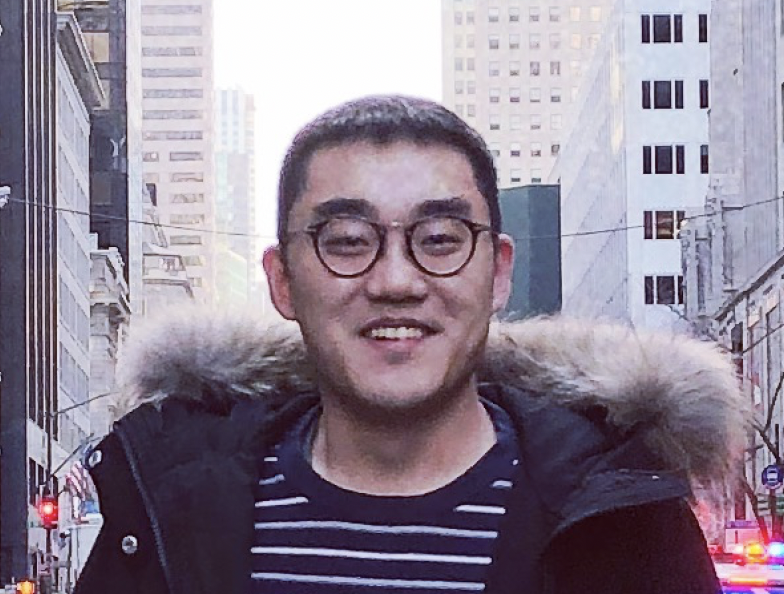

## About Me

Hi!  I’m a research engineer at Facebook AI Research working on game and reinforcement learning. I joined the team in 2018. Prior to that, I received master degree specialized in machine learning from Telecom ParisTech and University Paris 6. Throughout my studies, I am interested in both engineering and AI research. 

You may also find me by my legal name **Da JU**.

## Research Interest

Reinforcement Learning, Game AI. 

## Academia

In 2015, I finished my undergraduate in Information Science and Engineering at [Southeast University](http://www.seu.edu.cn/english/main.htm), Nanjing, China. I wrote my [Bachelor's thesis](bachelor-thesis.pdf), "High-resolution LED Headlamps Testing System with Web GUI" at [L-LAB](http://www.l-lab.de/llab/index.html), Lippstadt, Germany. It documents the development of WiFi based system for controlling cars. The thesis remains Intellectual property of [HELLA](https://www.hella.com/hella-com/index.html).

In 2017, I finished my Master's degree at [Telecom ParisTech](https://www.telecom-paristech.fr/), Paris, France, focussing on Machine Learning and Humain Computer Interaction. I also recived a second master degree from [UPMC university](http://www.upmc.fr/en/), Paris, France in Data Science.

## Publications

1. Gehring, Jonas, **Da Ju**, Vegard Mella, Daniel Gant, Nicolas Usunier, and Gabriel Synnaeve. “High-Level Strategy Selection under Partial Observability in StarCraft: Brood War.” ArXiv:1811.08568 [Cs, Stat], November 20, 2018. http://arxiv.org/abs/1811.08568.
